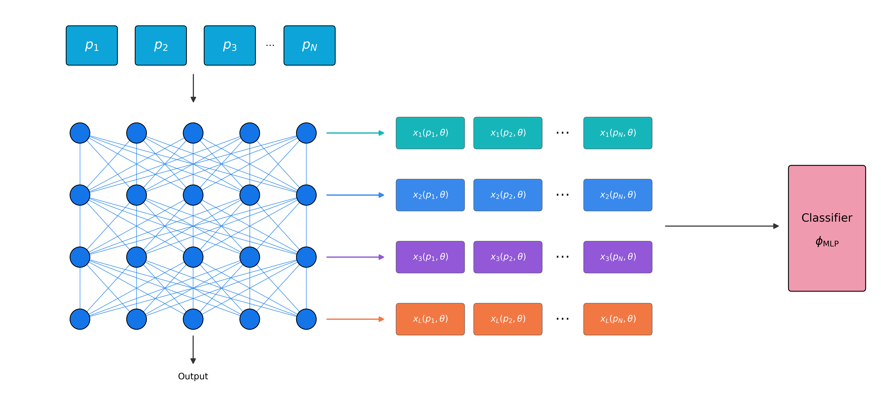

# HiddenProbe

HiddenProbe learns representations of neural networks by evaluating learned probes on a frozen target network and using responses from its hidden layers for downstream prediction. This repository contains the implementation and experiment scripts for INR classification and model accuracy prediction.

<p align="center">
  
</p>

## Installation

```bash
git clone https://github.com/yonatansverdlov/HiddenProbe.git
cd HiddenProbe
conda create -n hiddenprobe python=3.11
conda activate hiddenprobe
pip install -r requirements.txt
```

Run all commands from the repository root. Each experiment script automatically downloads or prepares the required dataset before training.

## HiddenProbe experiments

### INR classification

**MNIST**

```bash
./scripts/HiddenProbe/classification/run_mnist_inr.sh
```

**Fashion-MNIST**

```bash
./scripts/HiddenProbe/classification/run_fmnist_inr.sh
```

**CIFAR-10**

```bash
./scripts/HiddenProbe/classification/run_cifar10_inr_nonaug.sh
```

**CIFAR-10 Augmented**

```bash
./scripts/HiddenProbe/classification/run_cifar10_inr_aug.sh
```

### Model accuracy prediction

**MNIST**

```bash
./scripts/HiddenProbe/regression/run_mnist_regression.sh
```

**Fashion-MNIST**

```bash
./scripts/HiddenProbe/regression/run_fmnist_regression.sh
```

**SVHN**

```bash
./scripts/HiddenProbe/regression/run_svhn_regression.sh
```

**CIFAR-10 Gray Scale**

```bash
./scripts/HiddenProbe/regression/run_cifar10_gs_regression.sh
```

**CIFAR-10 Wild Park**

```bash
./scripts/HiddenProbe/regression/run_cifar10_wp_regression.sh
```

### Transformer accuracy prediction

For MNIST-Transformers and AGNews-Transformers we report five accuracy-threshold settings. For each threshold, target models below the threshold are removed first, and the remaining population is then split into 70% train, 15% validation, and 15% test. Each script runs five training seeds.

**MNIST-Transformers**

```bash
./scripts/HiddenProbe/regression/run_mnist_transformer_thresh0.sh
./scripts/HiddenProbe/regression/run_mnist_transformer_thresh20.sh
./scripts/HiddenProbe/regression/run_mnist_transformer_thresh40.sh
./scripts/HiddenProbe/regression/run_mnist_transformer_thresh60.sh
./scripts/HiddenProbe/regression/run_mnist_transformer_thresh80.sh
```

**AGNews-Transformers**

```bash
./scripts/HiddenProbe/regression/run_agnews_transformer_thresh0.sh
./scripts/HiddenProbe/regression/run_agnews_transformer_thresh20.sh
./scripts/HiddenProbe/regression/run_agnews_transformer_thresh40.sh
./scripts/HiddenProbe/regression/run_agnews_transformer_thresh60.sh
./scripts/HiddenProbe/regression/run_agnews_transformer_thresh80.sh
```

## ProbeGen experiments

All ProbeGen runs use **128 probes**. The MNIST-/Fashion-MNIST-INR scripts retain the original single seed (seed 1); the other INR/CNN scripts and each Transformer threshold run five seeds. The Transformer reference scripts used 256 probes; the runners below use 128 as specified for this repository.

Each runner prepares or verifies its dataset before training. For CIFAR-10 Wild Park, ProbeGen reuses the **same** prebuilt `cnn_cache_{train,val,test}.pt` files as HiddenProbe, from `$PGH_WP_CACHE` or `data/regression/cifar10_wp/wp_cnn_cache/`, without extracting individual checkpoints. The augmented CIFAR-10 ProbeGen run uses 20 additional INR realizations as in its source script.

### INR classification

**MNIST-INR**

```bash
./scripts/ProbeGen/classification/run_mnist_inr.sh
```

**Fashion-MNIST-INR**

```bash
./scripts/ProbeGen/classification/run_fmnist_inr.sh
```

**CIFAR-10-INR**

```bash
./scripts/ProbeGen/classification/run_cifar10_inr_nonaug.sh
```

**CIFAR-10-INR augmented**

```bash
./scripts/ProbeGen/classification/run_cifar10_inr_aug.sh
```

### CNN accuracy prediction

**MNIST**

```bash
./scripts/ProbeGen/regression/run_mnist_regression.sh
```

**Fashion-MNIST**

```bash
./scripts/ProbeGen/regression/run_fmnist_regression.sh
```

**SVHN**

```bash
./scripts/ProbeGen/regression/run_svhn_regression.sh
```

**CIFAR-10 Gray Scale**

```bash
./scripts/ProbeGen/regression/run_cifar10_gs_regression.sh
```

**CIFAR-10 Wild Park**

```bash
./scripts/ProbeGen/regression/run_cifar10_wp_regression.sh
```

### Transformer accuracy prediction

Run each threshold separately (0%, 20%, 40%, 60%, 80%). Each threshold script trains five seeds and reuses the threshold-specific dataset cache.

**MNIST-Transformers**

```bash
./scripts/ProbeGen/regression/run_mnist_transformer_thresh0.sh
./scripts/ProbeGen/regression/run_mnist_transformer_thresh20.sh
./scripts/ProbeGen/regression/run_mnist_transformer_thresh40.sh
./scripts/ProbeGen/regression/run_mnist_transformer_thresh60.sh
./scripts/ProbeGen/regression/run_mnist_transformer_thresh80.sh
```

**AGNews-Transformers**

```bash
./scripts/ProbeGen/regression/run_agnews_transformer_thresh0.sh
./scripts/ProbeGen/regression/run_agnews_transformer_thresh20.sh
./scripts/ProbeGen/regression/run_agnews_transformer_thresh40.sh
./scripts/ProbeGen/regression/run_agnews_transformer_thresh60.sh
./scripts/ProbeGen/regression/run_agnews_transformer_thresh80.sh
```

## Repository structure

```text
main.py                         Main experiment entry point
models/                         HiddenProbe models and trainers
scripts/HiddenProbe/            HiddenProbe experiments and sweeps
scripts/ProbeGen/               ProbeGen experiment runners
scripts/setup_data/             Automatic dataset download and preparation
```

## Citation

Coming soon.
